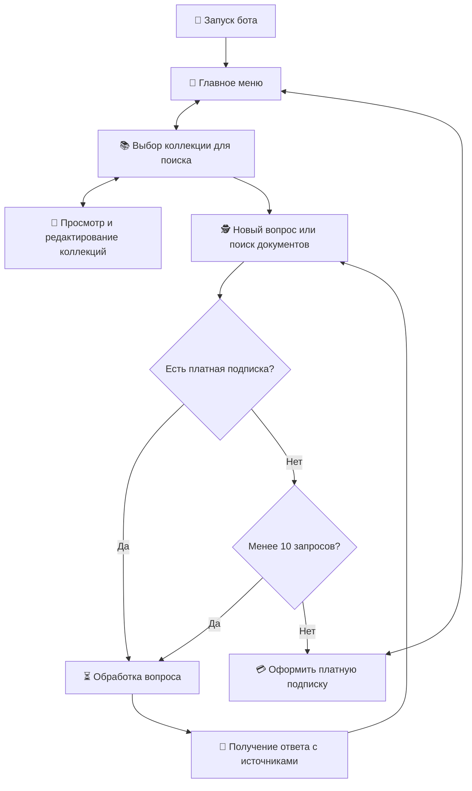
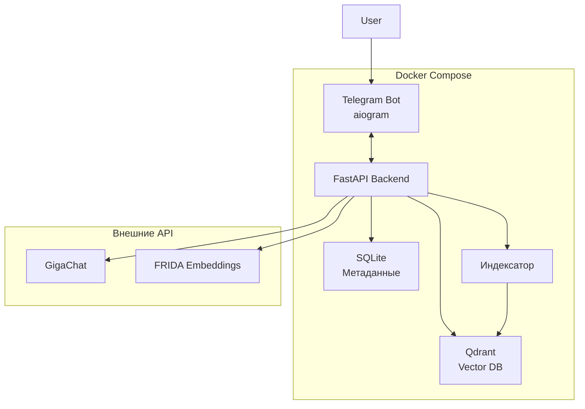
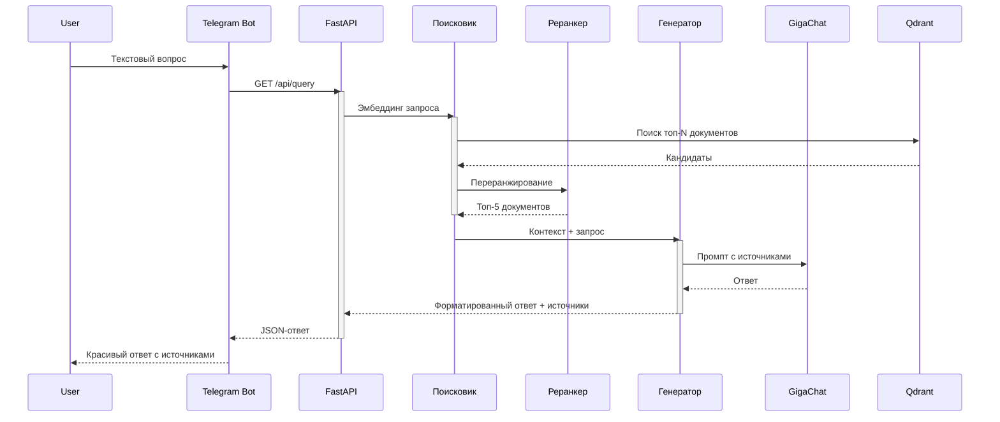

# LLM для юристов (Unfinished)

## 1. Описание продукта

**Saul Goodman** — это Telegram-бот для юристов и юридических департаментов различных компаний. Он использует технологию **RAG (Retrieval-Augmented Generation)** для быстрого семантического поиска документов по внутренней базе знаний и предоставления точных, обоснованных ответов на естественном языке с обязательными ссылками на источники.

**RAG (Retrieval-Augmented Generation)** — современный подход к работе с большими языковыми моделями, сочетающий два этапа:
- **Retrieval** — поиск наиболее релевантных фрагментов (чанков) из векторной базы документов по смыслу запроса;
- **Augmented Generation** — передача найденных фрагментов в LLM в качестве контекста, чтобы модель генерировала ответ исключительно на основе предоставленных данных.

**Преимущества RAG перед обычными LLM:**
- минимизация галлюцинаций;
- подкрепление всех ответов источниками;
- полная конфиденциальность — данные не покидают контур компании;
- актуальность, ведь ответы всегда основаны на последней версии загруженных документов.

### 1.1. Актуальность продукта

Сегодня юристы тратят огромное количество времени на изучение информации в сотнях документов: PDF, DOCX и TXT файлах. Ручной поиск часто упускает смысловые связи и синонимы, а использование LLM приводит к галлюцинациям, — когда модель может сослаться на несуществующие статьи закона или пункты договора.

### 1.2. Ключевые особенности продукта

- Семантический поиск по внутренней базе компании.
- Обязательное указание источников в ответах.
- Поддержка ключевых форматов: `.pdf`, `.docx`, `.txt`.
- Freemium-модель: 10 бесплатных запросов, далее — платная подписка.
- Возможность создания и управления несколькими коллекциями документов.

## 2. Пользовательский опыт

Пользователь взаимодействует исключительно с Telegram-ботом.

### 2.1. Основной сценарий использования

### 2.2. Примеры взаимодействия

**Пример 1: поиск по договору**  
Пользователь:  
> Найди все договоры поставки с ООО "Ромашка" и укажи ответственность за просрочку.

Бот:  
> Изучаю базу знаний...

> Согласно пункту 4.3 Договора поставки № 57/2024 от 15.03.2024, ответственность за просрочку поставки составляет 0,5 % от стоимости недопоставленного товара за каждый день просрочки, но не более 10 %.

> **Источники:**  
> • Договор_поставки_Ромашка_2024.pdf (стр. 7, пункт 4.3)  
> • Дополнительное соглашение №1.docx (стр. 2)

**Пример 2: Вопрос по законодательству**  
Пользователь:  
> Какая ответственность для ИП за неуплату налогов по УСН?

Бот:  
> Согласно ст. 122 НК РФ непредставление (несвоевременное представление) налоговой декларации или неуплата налога влечёт штраф в размере 5–30 % от неуплаченной суммы (минимум 1000 ₽).

> **Источники:**  
> • Налоговый_кодекс_РФ_часть_1.pdf (ст. 122)

## 3. Архитектура и технологии

### 3.1. Технологический стек

| Компонент              | Технология                          | Обоснование |
|------------------------|-------------------------------------|-------------|
| **Backend**            | Python, FastAPI, dishka         | Асинхронность, удобное DI, быстрый разработческий цикл |
| **Telegram Bot**       | aiogram 3.x                         | Современный асинхронный фреймворк с FSM |
| **Vector DB**          | Qdrant | Qdrant — production-ready, фильтры по метаданным, масштабируемость |
| **Эмбеддинги**         | FRIDA        | Лидер на MTEB Russian leaderboard 2025 |
| **Реранкер**           | BGE   | Улучшение качества топ-5 результатов |
| **LLM**                | GigaChat API            | Лучшая поддержка русского юридического языка |
| **Оркестрация RAG**    | LangChain                           | Готовые цепочки retrieval + generation |
| **БД метаданных**      | SQLAlchemy + SQLite | Хранение пользователей, подписок, коллекций |
| **Контейнеризация**    | Docker + Docker Compose             | Локальная разработка и деплой |

### 3.2. Архитектура системы

### 3.3. Процесс обработки запроса

## 4. Организация командной работы и распределение задач

| Участник                | Роль                          | Зона ответственности |
|-------------------------|-------------------------------|----------------------|
| **Космынин Александр**  | **Team Lead, Backend**        | Общая архитектура, API (FastAPI), Dependency Injection (dishka), code review |
| **Малакшанидзе Анна**    | **ML & Data Engineer**       | Эмбеддинги (FRIDA), RAG-пайплайн (LangChain), реранкер (BGE), валидация качества (hit@5), индексация, RDB (SQLAlchemy + SQLite), VDB (Qdrant) |
| **Дугаев Дмитрий**      | **DevOps & QA**               | Docker, CI/CD, тесты (pytest), инфраструктура, мониторинг |
| **Белоусов Тимофей**    | **Frontend & Bot Developer**  | Telegram-бот (aiogram), UX/UI, обработчики, платёжный сервис (Telegram Payments)|

## 5. План разработки MVP

| Блок | Задачи | Оценка (часы) | Ответственный |
|------|--------|---------------|---------------|
| **1. Данные и векторы** | Выбор и внедрение FRIDA, слой работы с Qdrant, разработка RDB, пайплайн индексации и ретривала  | 24–40 | Анна |
| **2. RAG & ML сервисы** | LangChain-цепочка, слой генерации, реранкер, тестовый датасет + hit@5 | 24–32 | Анна |
| **3. Backend** | FastAPI API, dishka DI, контракты | 24–32 | Александр |
| **4. Telegram Бот** | aiogram, обработчики, интеграция с API, счётчик запросов, платёжный сервис | 24–32 | Тимофей |
| **5. DevOps & QA** | CI/CD, pytest, docker-compose | 24–32 | Дмитрий |

**Общий срок реализации MVP:** 3-4 недели при параллельной работе членов команды.

