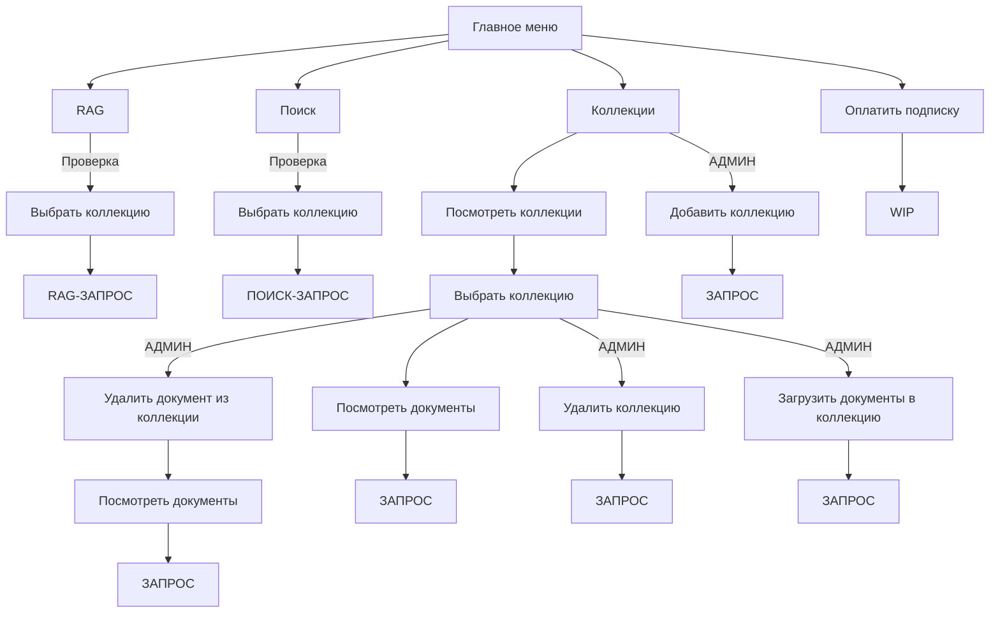

# Документация

## User experience
Схема, показывающая опыт взаимодействия пользователя с ботом.

```mermaid
graph TD
  A[Главное меню] --> B[RAG]
  B --> |Проверка| F[Выбрать коллекцию]
  F --> G1[RAG-ЗАПРОС]
  A --> I[Поиск]
  I --> |Проверка| J[Выбрать коллекцию]
  J --> K[ПОИСК-ЗАПРОС]
  A --> L[Коллекции]
  L --> M[Посмотреть коллекции]
  M --> Z[Выбрать коллекцию]
  L --> |АДМИН| N[Добавить коллекцию]
  Z --> |АДМИН| O[Удалить коллекцию]
  Z --> |АДМИН| P[Загрузить документы в коллекцию]
  Z --> |АДМИН| Q[Удалить документ из коллекции]
  Q --> R2.1[Посмотреть документы]
  Z --> R1.1[Посмотреть документы]
  R1.1 --> R1.2[ЗАПРОС]
  R2.1 --> R2.2[ЗАПРОС]
  N --> R2[ЗАПРОС]
  O --> R3[ЗАПРОС]
  P --> R4[ЗАПРОС]
  A --> S[Оплатить подписку]
  S --> T[WIP]  
```
